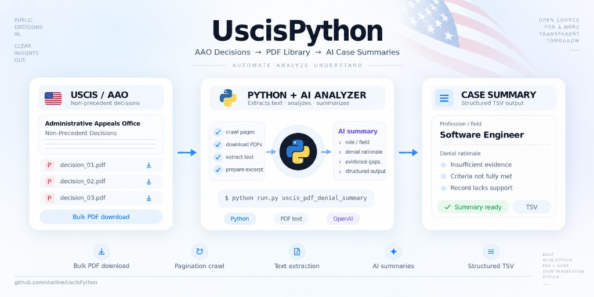

# UscisPython



Small Python toolkit for working with **USCIS Administrative Appeals Office (AAO) non-precedent decisions**: bulk-download decision PDFs from the public listing, then summarize each case (beneficiary role and denial rationale) using the OpenAI API.

## Features

- **PDF download** — Crawls the [AAO non-precedent decisions](https://www.uscis.gov/administrative-appeals/aao-decisions/aao-non-precedent-decisions) list, follows Drupal pagination (`rel="next"`), downloads linked `.pdf` files, and logs successful URLs.
- **Denial summary** — Reads text from downloaded PDFs (embedded text only; no OCR), sends an excerpt to OpenAI Chat Completions, and writes a UTF-8 TSV with filename, beneficiary profession/title/field (in Russian), and a detailed denial/evidence summary (in Russian).

## Requirements

- Python 3.10+ (uses `str | None` style hints in the summary script)
- Dependencies: see [`requirements.txt`](requirements.txt)

## Setup

```bash
python -m venv .venv
# Windows: .venv\Scripts\activate
# Unix:    source .venv/bin/activate
pip install -r requirements.txt
```

For the summary step, copy [`.env.example`](.env.example) to `.env` and set `OPENAI_API_KEY`. Optionally set `OPENAI_MODEL` (default in code: `gpt-4o-mini`).

## Usage

The repo includes a small launcher that runs scripts from the `scripts/` folder:

```bash
python run.py --list
python run.py uscis_pdf_download
python run.py uscis_pdf_denial_summary
```

You can also run scripts directly:

```bash
python scripts/uscis_pdf_download.py
python scripts/uscis_pdf_denial_summary.py --help
```

### `uscis_pdf_download`

- **Input:** Hard-coded start URL in the script (filters for month/year and page size can be adjusted there).
- **Output:**
  - PDFs → `files/uscis_pdfs/pdfs/`
  - Successful PDF URLs (rewritten each run) → `files/uscis_pdfs/pdf_urls.txt`

### `uscis_pdf_denial_summary`

- **Input:** `*.pdf` under `files/uscis_pdfs/pdfs/` by default (override with `--dir`).
- **Output:** TSV `files/uscis_pdfs/summary_denials.txt` (tab-separated: `filename`, profession summary, denial summary), unless you pass `--output`.
- **Options:** `--dir`, `--output`, `--model` (or use `OPENAI_MODEL` in the environment).

**Note:** Only the first ~12,000 characters of extracted text per PDF are sent to the model. Scanned PDFs without a text layer will produce empty extraction and a placeholder explanation.

## Project layout

| Path | Purpose |
|------|---------|
| `run.py` | Launcher: `python run.py <script_name> [args...]` |
| `scripts/uscis_pdf_download.py` | Fetch AAO non-precedent PDFs |
| `scripts/uscis_pdf_denial_summary.py` | OpenAI-based summaries |
| `files/uscis_pdfs/` | Downloaded PDFs, URL log, and summary TSV |
| `requirements.txt` | Python dependencies |
| `.env` | Local secrets (not committed); see `.env.example` |

## Legal and ethical use

This project automates access to **publicly published** USCIS decision pages. Respect [USCIS terms of use](https://www.uscis.gov/website-policies), avoid aggressive scraping, and ensure your use of downloaded materials and API-generated summaries complies with applicable law and professional rules. API output may be inaccurate; verify against the original PDFs for any important decision.

## License

Not specified in this repository; add a `LICENSE` file if you need one.
